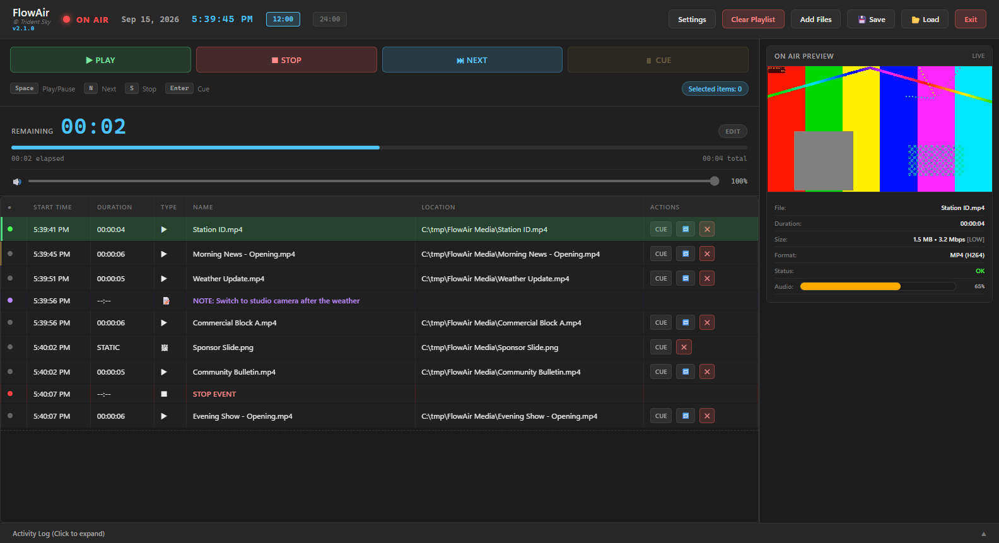

# FlowAir

Professional 24/7 broadcast playout for Windows. Build a playlist of videos and images, press Play, and FlowAir keeps your channel on air with accurate start times, OBS automation and a clean full-screen output.



## Features

- **Zero-drift scheduling** — start times are anchored to an absolute clock, so a playlist that runs for days stays on time
- **Live playlist editing** — add, drag, copy/paste, loop and cue items while on air without touching what is playing
- **Event rows** — STOP events to hold the channel, notes for the operator, and OBS events to switch scenes or show/hide sources
- **Full-screen output** on any connected display, plus a browser player for OBS or other computers on your network
- **Live controls** — output volume and timeline scrubbing behind an edit-mode safety lock
- **File checks** — corrupt or missing files are marked red and skipped automatically
- **Session recovery** — after a crash or power cut FlowAir offers to restore the last playlist
- **Update notifications** when a new release is published

## Install

1. Download **FlowAir-Setup.exe** from [Releases](https://github.com/TridentSky/FlowAir/releases/latest)
2. Run it. Windows may show a blue **"Windows protected your PC"** warning because the app is not code-signed yet — click **More info** and then **Run anyway**
3. Accept the administrator prompt and choose an install folder
4. Open FlowAir from the desktop or Start Menu shortcut

Everything FlowAir needs is included. There is nothing else to install: no Python, Node.js or FFmpeg.

> **Note:** If Windows blocks the installer completely (Smart App Control), open **Windows Security > App & browser control > Smart App Control** and set it to **Off**.

**Requirements:** Windows 10 or Windows 11 (64-bit). H.264 video plays on every PC; H.265/HEVC needs the *HEVC Video Extensions* from the Microsoft Store.

**Uninstall** from *Settings > Apps*. FlowAir removes its settings and cached data. Your saved `.flowair` playlists and your media files are never touched.

## Using FlowAir

| Task | How |
| --- | --- |
| Add media | **Add Files**, or drag videos and images onto the playlist |
| Go on air | **PLAY** (`Space`) |
| Jump to an item | Select it and press **NEXT** (`N`), or **CUE** it (`Enter`) and press Play |
| Hold the channel | Right-click the playlist > **Insert STOP Event** |
| Operator notes | Right-click > **Insert Note** (double-click a note to edit it) |
| OBS automation | Connect in **Settings > OBS**, then right-click > **Insert OBS Event** |
| Full-screen output | **Settings > Output**, choose a display and apply |
| Player for OBS | Add a Browser Source with `http://localhost:8000/player` |
| Player on other computers | **Settings > Network > Enable Network Streaming** |
| Save or load a playlist | **Save** / **Load**, or drop a `.flowair` file on the playlist |

### Keyboard shortcuts

| Key | Action |
| --- | --- |
| `Space` | Play / Stop |
| `N` | Next |
| `S` | Stop |
| `Enter` | Cue the selected item |
| `Up` / `Down` | Move the selection |
| `Delete` | Remove the selected items |
| `Ctrl+C` / `Ctrl+V` | Copy / paste items |
| `Ctrl+Z` | Undo |
| `Ctrl+Shift+E` | Close the full-screen output (works from any window) |

## Troubleshooting

- **"Port 8000 is being used by another program"** — the playout engine needs port 8000. Close the program that is using it (or restart the computer) and open FlowAir again.
- **"The FlowAir playout engine could not start"** — an antivirus may have blocked `flowair-backend.exe`. Restore it or add an exception for the FlowAir folder, then reinstall.
- **Black video** — the file uses a codec Windows cannot decode (usually HEVC). Install *HEVC Video Extensions* or convert the file to H.264.
- **The full-screen output closed by itself** — its display was disconnected. Reconnect it and apply the Output settings again.
- **A network player shows "Access denied"** — turn on *Network Streaming* in **Settings > Network** on the FlowAir computer. Only the player is shared; the playlist can only be controlled from the FlowAir computer.

## Build from source

You need [Node.js](https://nodejs.org) 18 or newer, [Python](https://www.python.org) 3.11 or newer, and `ffprobe.exe` from an [FFmpeg build](https://github.com/BtbN/FFmpeg-Builds/releases) placed in `ffmpeg/bin/`.

Run in development mode (installs dependencies on first run):

```
START.bat
```

Build the Windows installer:

```
cd frontend
npm install
npm run dist
```

The installer is written to `Installer/FlowAir-Setup.exe`.

### Project structure

```
FlowAir/
├── backend/      Playout engine: scheduling, playlist, file validation, OBS control (FastAPI)
├── frontend/     Desktop app (Electron + React)
├── build/        Installer resources and build script
├── ffmpeg/bin/   ffprobe.exe (not included in the repository)
└── START.bat     Development launcher
```

## Built With

- [Electron](https://www.electronjs.org) and [React](https://react.dev) — desktop app
- [FastAPI](https://fastapi.tiangolo.com) and [Uvicorn](https://www.uvicorn.org) — playout engine
- [FFmpeg](https://ffmpeg.org) (ffprobe) — media validation ([LGPL/GPL](https://ffmpeg.org/legal.html))
- [obsws-python](https://github.com/aatikturk/obsws-python) — OBS WebSocket control
- Developed with [Claude Code](https://claude.ai/claude-code)

## License

MIT License — see [LICENSE](LICENSE) for details.

FFmpeg is an independent project with its own license.
